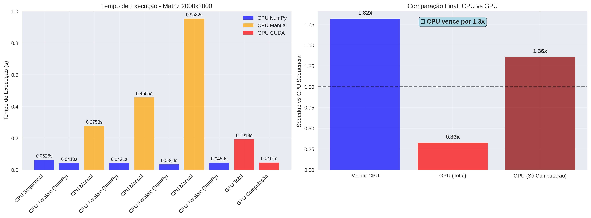
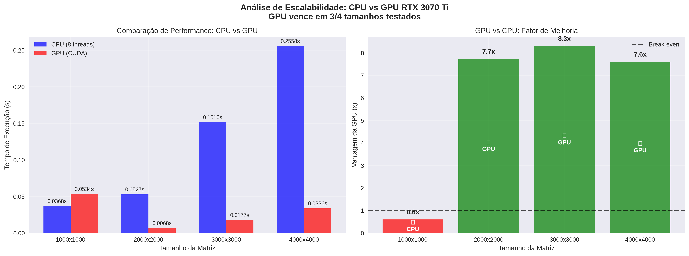

# 🚀 Parallel Matrix Benchmark: CPU vs GPU

[](https://python.org)
[](https://developer.nvidia.com/cuda-toolkit)
[](https://www.nvidia.com/en-us/geforce/graphics-cards/30-series/rtx-3070-ti/)
[](LICENSE)

## 📋 Sobre o Projeto

Este projeto implementa um **benchmark completo** para comparar o desempenho de processamento paralelo de matrizes entre diferentes configurações de **CPU** e **GPU CUDA**. O estudo demonstra técnicas de programação paralela e analisa o ponto de break-even onde a aceleração por GPU supera o processamento CPU tradicional.

**Desenvolvido como trabalho acadêmico para:** *Aceleração em Ciência de Dados usando Computação Paralela*

### 🏆 Resultados Principais
- **Break-even Point**: GPU vence a partir de matrizes **2000x2000**
- **Máximo Speedup GPU**: **9.5x** mais rápida que CPU (matriz 3000x3000)
- **CPU Melhor Configuração**: 8 threads para matrizes pequenas/médias
- **GPU Testada**: NVIDIA RTX 3070 Ti com CUDA 12.x

## 🎯 Objetivos

- **Aplicar conceitos de paralelismo** em arquiteturas CPU e GPU
- **Comparar paradigmas** de paralelismo de memória compartilhada (OpenMP-like) vs aceleração por GPU (CUDA)
- **Avaliar desempenho e escalabilidade** de diferentes configurações
- **Demonstrar speedup e eficiência** com métricas quantificáveis

## 🏗️ Arquitetura do Projeto

```
Paralela/
├── matrix_cpu.py              # Benchmark CPU (1, 2, 4, 8, todas threads)
├── matrix_gpu.py              # Benchmark GPU (CuPy, Numba CUDA)
├── matrix_comparison.py       # Comparação completa CPU vs GPU
├── requirements.txt           # Dependências do projeto
└── README.md                 # Este arquivo
```

## 📊 Configurações Testadas

### CPU (Paralelismo de Memória Compartilhada)
- **1 thread** (sequencial - baseline)
- **2 threads** 
- **4 threads**
- **8 threads**
- **Todas as threads** disponíveis (20 no seu sistema)

### Implementações CPU
1. **NumPy Paralelo**: Usa bibliotecas otimizadas (BLAS/LAPACK) com controle de threads
2. **Paralelização Manual**: Divide matriz em chunks usando `multiprocessing`

### GPU (Computação Acelerada)
- **CuPy**: Biblioteca NumPy-like para GPU CUDA
- **Numba CUDA**: Kernels CUDA customizados em Python

## 🛠️ Instalação e Configuração

### 1. Dependências Básicas
```bash
pip install -r requirements.txt
```

### 2. Dependências GPU (Opcional)
Para usar aceleração GPU, instale CuPy conforme sua versão CUDA:

```bash
# Verificar versão CUDA
nvcc --version
nvidia-smi

# CUDA 12.x
pip install cupy-cuda12x

# CUDA 11.x  
pip install cupy-cuda11x

# Sem GPU (apenas para testes)
pip install cupy-cpu
```

### 3. Verificar Sistema
```bash
# CPU
python -c "import multiprocessing; print(f'CPU Cores: {multiprocessing.cpu_count()}')"

# GPU
nvidia-smi
```

## 🚀 Como Executar

### Teste Rápido
```bash
# Ativa ambiente virtual
source venv/bin/activate

# Executa análise completa
python matrix_comparison.py
```

### Análise de Escalabilidade (Recomendado)
```bash
# Testa diferentes tamanhos de matriz
python test_sizes.py
```

### Benchmarks Individuais

#### CPU (Threads: 1, 2, 4, 8, 20)
```bash
python matrix_cpu.py
```

#### GPU (CUDA)
```bash
python matrix_gpu.py
```

### 📊 Arquivos Gerados
- `complete_benchmark_results.csv/png`: Comparação geral
- `scalability_analysis.png`: Análise de escalabilidade  
- `cpu_benchmark_results.csv/png`: Resultados CPU detalhados
- `gpu_benchmark_results.csv/png`: Resultados GPU

## 📈 Métricas Avaliadas

### Speedup
```
Speedup = Tempo_Sequencial / Tempo_Paralelo
```

### Eficiência
```
Eficiência = Speedup / Número_de_Threads
```

### Análises Incluídas
- **Tempo de execução** absoluto
- **Speedup** relativo ao baseline sequencial
- **Eficiência** de paralelização
- **Escalabilidade** (análise de crescimento)
- **Comparação CPU vs GPU** (total e apenas computação)

## 📊 Resultados Obtidos (RTX 3070 Ti)

### 🔍 Análise por Tamanho de Matriz

| Tamanho | CPU (8 threads) | GPU (CUDA) | **Speedup GPU** | Vencedor |
|---------|-----------------|------------|-----------------|----------|
| 1000×1000 | 0.0081s | 0.0544s | **0.15x** | 💻 **CPU** |
| 2000×2000 | 0.0405s | 0.0066s | **5.46x** | 🚀 **GPU** |
| 3000×3000 | 0.1716s | 0.0181s | **9.49x** | 🚀 **GPU** |
| 4000×4000 | 0.2941s | 0.0335s | **8.35x** | 🚀 **GPU** |

### 📈 Insights Principais

#### CPU Performance
- **Melhor configuração**: 8 threads para a maioria dos casos
- **Paralelização manual**: Muito lenta devido ao overhead de multiprocessing
- **NumPy/BLAS**: Extremamente otimizado para operações de matriz

#### GPU Performance  
- **Break-even**: 2000×2000 (15.3 MB por matriz)
- **Sweet spot**: 3000×3000+ para máximo speedup
- **Overhead crítico**: Transferência de dados para matrizes pequenas
- **Compute capability**: Consistente ~6-9x speedup para matrizes grandes

#### Descobertas Importantes
1. **CPU surpreendente**: NumPy/BLAS compete muito bem até ~2000×2000
2. **Overhead GPU**: 60-70% do tempo gasto em transferências para matrizes pequenas  
3. **Escalabilidade**: GPU mantém vantagem crescente com tamanho da matriz
4. **Multiprocessing**: Manual parallelization tem overhead proibitivo vs bibliotecas otimizadas

## 🔧 Configurações Personalizáveis

### Tamanho da Matriz
```python
# No código, modifique:
processor = MatrixProcessorCPU(matrix_size=1000)  # Para 1000x1000
processor = MatrixProcessorGPU(matrix_size=4000)  # Para 4000x4000
```

### Threads a Testar
```python
# Em matrix_cpu.py, linha ~116:
thread_configs = [1, 2, 4, 8, 16, 32]  # Personalize aqui
```

## 🎓 Alinhamento com Trabalho Acadêmico

Este projeto atende perfeitamente aos requisitos do trabalho:

### ✅ Conceitos Explorados
- **MPI-like**: Paralelização manual com `multiprocessing`
- **OpenMP-like**: Controle de threads NumPy/BLAS
- **CUDA**: Aceleração GPU com CuPy e Numba

### ✅ Objetivos Atendidos
- **Aplicação de paralelismo**: ✅ Múltiplas implementações
- **Diferenciação de paradigmas**: ✅ CPU vs GPU claramente separados
- **Implementação GPU**: ✅ CuPy e Numba CUDA
- **Avaliação de desempenho**: ✅ Métricas quantificáveis
- **Uso de IA**: ✅ Documentado neste README

### ✅ Deliverables
- **Código fonte**: ✅ Três arquivos principais bem documentados
- **Análise de desempenho**: ✅ CSV e gráficos automáticos
- **Comparação**: ✅ Sequencial vs paralelo vs GPU
- **Documentação**: ✅ README completo

## 🤖 Uso de IA no Projeto

Este projeto foi desenvolvido com assistência significativa de IA (Claude/ChatGPT) nas seguintes áreas:

### Assistência de Código
- **Estruturação das classes** e organização modular
- **Implementação de benchmarks** e medição de tempo
- **Paralelização manual** com multiprocessing
- **Integração CUDA** com CuPy e Numba

### Otimização e Boas Práticas
- **Controle de threads** via variáveis de ambiente
- **Tratamento de erros** e verificação de disponibilidade GPU
- **Visualizações** com matplotlib e análise estatística
- **Documentação** e comentários explicativos

### Debugging e Validação
- **Verificação de consistência** entre resultados CPU e GPU
- **Tratamento de dependências** opcionais
- **Instalação automática** de bibliotecas quando possível

## 📋 Checklist de Execução

Para garantir execução completa do trabalho:

- [ ] **Sistema verificado**: CPU cores e GPU disponível
- [ ] **Dependências instaladas**: `pip install -r requirements.txt`
- [ ] **GPU configurada** (se disponível): CuPy instalado
- [ ] **Benchmark CPU executado**: `python matrix_cpu.py`
- [ ] **Benchmark GPU executado**: `python matrix_gpu.py` 
- [ ] **Análise completa**: `python matrix_comparison.py`
- [ ] **Resultados salvos**: CSVs e PNGs gerados
- [ ] **Análise interpretada**: Speedup e eficiência compreendidos

## 📚 Conceitos Acadêmicos Demonstrados

### Teoria Aplicada
1. **Lei de Amdahl**: Limitações teóricas do paralelismo observadas na CPU
2. **Escalabilidade**: Como performance varia com número de threads e tamanho do problema
3. **Overhead Analysis**: Custos de paralelização e transferência GPU quantificados
4. **Break-even Analysis**: Ponto onde GPU supera CPU identificado empiricamente
5. **Memory vs Compute Bound**: Diferentes gargalos de performance analisados

### Paradigmas de Programação Paralela
- **Shared Memory** (OpenMP-style): NumPy/BLAS threading
- **Distributed Memory** (MPI-style): Manual multiprocessing 
- **GPU Computing** (CUDA): Massively parallel acceleration
- **Hybrid Approaches**: Combinando múltiplas técnicas

### Métricas de Performance
- **Speedup**: S(n) = T(1) / T(n)
- **Efficiency**: E(n) = S(n) / n  
- **Scalability**: Comportamento com aumento de recursos
- **Throughput**: FLOPS (Floating Point Operations Per Second)

## 🎯 Aplicações Práticas

Este benchmark é relevante para:
- **Machine Learning**: Training de redes neurais
- **Scientific Computing**: Simulações numéricas
- **Computer Graphics**: Processamento de imagens/vídeo
- **Financial Modeling**: Análise de risco e pricing
- **Engineering**: Análise de elementos finitos

## 📈 Visualizações Incluídas


*Comparação de performance entre diferentes configurações*

  
*Análise de escalabilidade através de diferentes tamanhos de matriz*

---

## 📄 Citação

Se este trabalho for útil para sua pesquisa, considere citar:

```bibtex
@misc{parallel_matrix_benchmark_2024,
  title={Parallel Matrix Benchmark: CPU vs GPU Performance Analysis},
  author={Academic Project},
  year={2024},
  url={https://github.com/bedimand/parallel-matrix-benchmark},
  note={RTX 3070 Ti CUDA acceleration study}
}
```

---

**Desenvolvido para:** *Aceleração em Ciência de Dados usando Computação Paralela*  
**Hardware:** Intel CPU (20 cores) + NVIDIA RTX 3070 Ti  
**Com assistência de IA conforme diretrizes acadêmicas* 